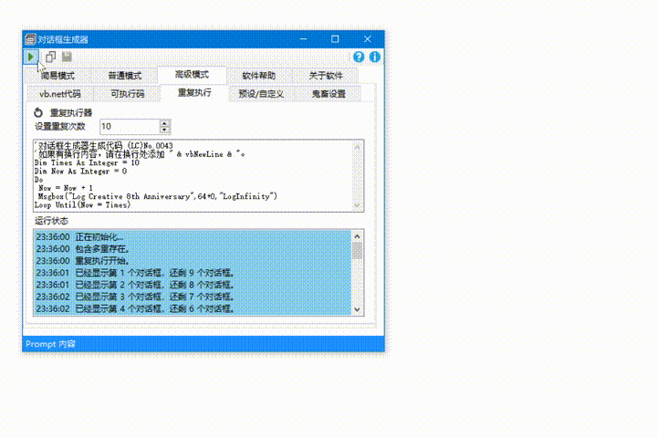

# Dialog Creator
A program to create dialog boxes conveniently.

(LC) LogCreative 2014 - 2015

> [Log Infinity Project](https://github.com/LogCreative/LogInfinity) Memory Box



## Repository Structure

```
DialogCreator
    |- 对话框生成器         Version 2.6 (2015)
    |- WindowsCreate.bat    Version 1.3 (2014)
```

You can get the release version of this program in [Release Page](https://github.com/LogCreative/DialogCreator/releases).

> Original Release Page: [【（自制）】对话框生成器](https://tieba.baidu.com/p/4158161804?pid=78992811420&cid=0&red_tag=2089301819#78992811420)

## Objective

- This program provides those who want to generate Windows dialogs a convienent and visualized way.
- This program provides a way to create multiple Windows dialogs by using timer to generate them with a certain amount of time gap.

## Compilation

The compilation should be performed carefully because the file is too old to open-and-compile correctly on modern operating systems.

### Windows Batch File (`.bat`)

To edit this file, you need to open `WindowsCreate.bat` file in notepad or in Visual Studio Code with the encoding of `GB 2312`. Using UTF-8 encoding will make the code unreadable and saving it will cause **invertible damage** towards the original encoding.

### Visual Basic .NET (`.sln`)

Visual Basic .NET solution file requires Visual Studio 2013+ to open, with .NET Framework 3.5 installed.

Before opening the solution file, please confirm your display font scaling is 100%. Otherwise, the project file will fail to display correctly and save such will casue **permenate damage** towards the original file. 

The bug of not correctly displaying `toolbar` in `VB.NET` has not been fixed since 2014 for Visual Studio.

The bugs of minimization and VBS Generator error are fixed.

## Copyright Changes

This repository now use MIT LICENSE, which means you can modify and redistribute this program under the license requirement, i.e., appending the original website to your modified program.

This overrides all "ALL RIGHT RESERVED" claims in all source code with this README file appended.
